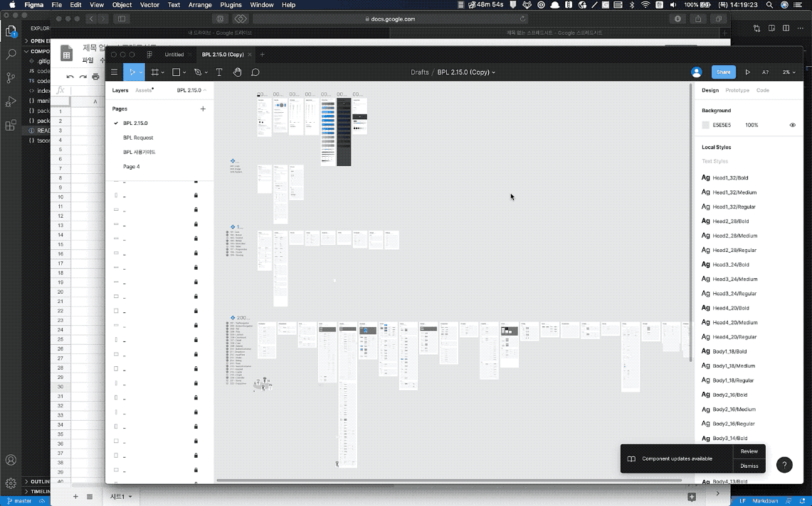
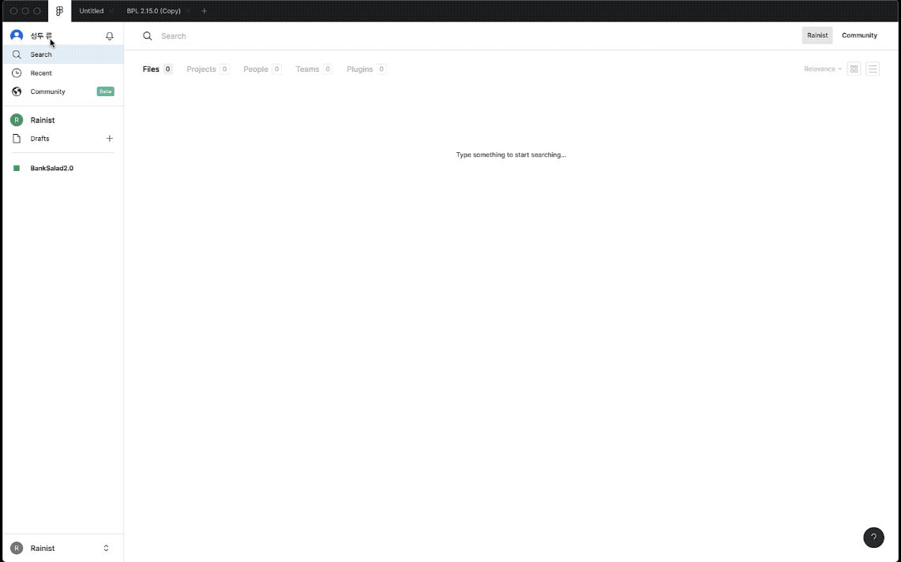

# figma-component-list-generator

[](https://opensource.org/licenses/MIT)

각 컴퍼넌트의 플랫폼별 개발 진행상황등을 지라나 엑셀등으로 관리할 수 있도록,
모든 컴퍼넌트의 리스트를 텍스트 파일 형태로 출력합니다.

[여기](https://www.figma.com/community/plugin/878196452411505693/Component-List-Generator) 에서 플러그인을 확인 후 설치하실 수 있습니다.

## 사용 방법



## 개발환경 설정하기

### 필수 도구 설치

다음의 도구들이 이미 설치되어 있지 않았다면, 먼저 설치해 주세요.

1. [Figma Desktop App](https://www.figma.com/downloads/)

2. [Node JS](https://nodejs.org)

```bash
brew install node@12
```

### 플러그인 설치

위 도구들이 깔려져 있다면, 본 프로젝트를 다운받아 빌드한 후 실행해 봅시다.

```shell
git clone https://github.com/Rainist/component-list-generator.git
cd component-list-generator
npm install
```

## 스타일 가이드

이 프로젝트는 [Rainist Web팀의 StyleGuide](https://github.com/Rainist/styleguide/tree/master/web)규칙을 따르고 있습니다.

### Visual Studio Code 설정 (옵션)

1. [Visual Studio Code](https://code.visualstudio.com)가 아직 없다면 다운받으세요!
2. Visual Studio Code로 프로젝트 폴더를 엽니다.
3. ⌘⇧B (Ctrl-Shift-B for Windows)를 누른 뒤, `tsc: watch - tsconfig.json` 을 선택합니다.
이렇게 하면 code.ts에 변화가 생길 때마다 새로운 code.js가 만들어질 겁니다.

Visual Studio Code를 쓰지 않는 분이라면, code.ts를 변경 한 뒤 `tsc --project tsconfig.json` 명령어를 CLI에서 수동으로 입력해 주세요.

### 플러그인 사용해보기

Figma Desktop App에서 개발중인 플러그인을 사용해 볼 수 있습니다.



이제 code.ts에 다양한 변화를 주고, ⌥⌘P(최근 실행한 플러그인 재실행 단축키) 를 눌러 변경 사항을 확인해 보세요!
